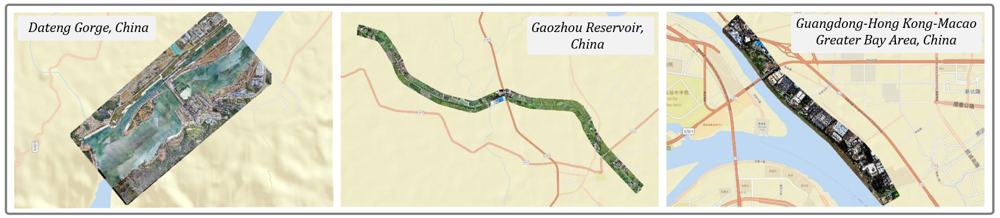

[中文文档](./README-zh.md)

# Water Conservancy Segment 3D

## Introduction

This dataset contains 3D laser point cloud scan data of large-scale outdoor hydraulic scenes in South China. It includes 3D point cloud data from multiple dams, reservoirs, and other watershed scenarios in the region. This dataset will be used to train and test environmental detection algorithms for accurate monitoring and analysis of hydraulic engineering environments.

For dataset creation, based on the national standard GBT 20257.1-2017 Basic Scale Map Symbols and combined with practical hydraulic engineering practices, the terrain feature classes for 3D point cloud segmentation were determined. There are 6 major categories and 15 minor categories, specifically as follows:

| Major Category |                 | Minor Category |         |
| -------------- | --------------- | -------------- | ------- |
| Water system   | Waterline       | Ditch          | Dam     |
| Bui. and fac.  | Shed            | Concrete House |         |
| Topography     | Slope           | Scarp          |         |
| Veg. and soil  | Vegetable Field | Grassland      | Dryland |
|                | Bareland        | Woodland       |         |
| Transportation | Cement Road     | Dirt Road      |         |
| Others         | Others          |                |         |

This dataset focuses on reservoir and river network areas, where terrain features are complex. Due to the indistinct boundaries of natural objects, this dataset is also significant for natural object segmentation tasks and can serve as a baseline dataset for evaluating the performance of 3D point cloud segmentation algorithms.

## Features

The main features of this dataset are as follows:

1. Multiple categories. As shown in Table 2.1, this dataset includes 15 minor categories, covering the main components of hydraulic facilities such as buildings, roads, terrain, and water bodies. These categories are rich and comprehensive, meeting the needs for multi-angle analysis of hydraulic facilities.
2. Large coverage area and large data volume. As shown in Table 2.2, the collected 3D point cloud data covers multiple typical hydraulic facility scenarios in South China, with a wide geographical range and good representativeness. The large sample size data is conducive to developing more robust algorithm models. The 3D point cloud data is divided into 3 Works according to different geographical locations: Work_1 is a key construction area of a hydraulic hub project in South China, with a total of 104,654,477 points; Work_2 is a hydraulic canal in South China, with a total of 131,112,786 points; Work_3 is a levee in South China, with a total of 28,895,223 points.
3. Real scene data with high-quality annotations. This data comes from aerial photography of actual hydraulic facilities, featuring real scene characteristics that can be directly used for testing and verification of related algorithms and products. Meanwhile, the dataset has undergone manual inspection and annotation to ensure accuracy and consistency of annotations. This lays a solid foundation for subsequent algorithm research based on this dataset.

Currently, publicly available 3D point cloud datasets mainly focus on indoor scenes or urban street scenes, with limited data on hydraulic facility scenes. This dataset helps fill this gap, providing basic data support for automated analysis and management of hydraulic facilities. With its large data volume, wide coverage, fine annotations, and reliable authenticity, this dataset can provide strong data support for the digital management of hydraulic facilities and is one of the richest and most valuable publicly available 3D point cloud datasets in hydraulic scenarios.

## Download

- Baidu Netdisk: <https://pan.baidu.com/s/1RFyvAMHZsB0kVxvv6PnlBw?pwd=ne9u> Extraction code: ne9u
- Kaggle: <https://www.kaggle.com/datasets/happycv/segment-hydraulic>

## Citation

If you use this dataset in your research, please click `Cite this repository` on the right side of the project to cite it.

Please ensure to comply with all terms of the CC BY-NC-SA 4.0 license.

# Usage Agreement

This dataset is licensed under the Creative Commons Attribution-NonCommercial-ShareAlike 4.0 International (CC BY-NC-SA 4.0) License.

## You are free to:

**Share** — copy and redistribute the material in any medium or format

**Adapt** — remix, transform, and build upon the material

The licensor cannot revoke these freedoms as long as you follow the license terms.

## Under the following terms:

**Attribution** — You must give appropriate credit , provide a link to the license, and indicate if changes were made . You may do so in any reasonable manner, but not in any way that suggests the licensor endorses you or your use.

**NonCommercial** — You may not use the material for commercial purposes .

**ShareAlike** — If you remix, transform, or build upon the material, you must distribute your contributions under the same license as the original.

**No additional restrictions** — You may not apply legal terms or technological measures that legally restrict others from doing anything the license permits.

# Contact

If you have any questions about the dataset, please feel free to contact [zhou_wei@xtu.edu.cn](mailto:zhou_wei@xtu.edu.cn).
